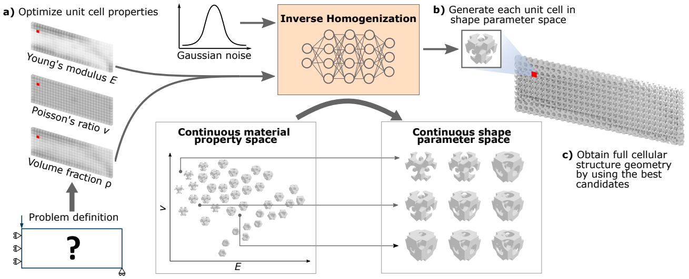
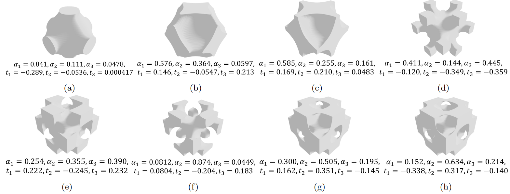

# IH-GAN_CMAME_2022
Data and code associated with our accepted CMAME 2022 paper: [IH-GAN: A Conditional Generative Model for Implicit Surface-Based Inverse Design of Cellular Structures](https://arxiv.org/pdf/2103.02588.pdf).

Also see our paper and poster at _ICML 2022 Workshop on Machine Learning in Computational Design_ [here](https://drive.google.com/drive/folders/1ZTo3-fOIBHGWAp6WwWkKhcdZCEfqq8V4?usp=sharing).



## License
This code is licensed under the MIT license. Feel free to use all or portions for your research or related projects so long as you provide the following citation information:

Wang, J., Chen, W. W., Da, D., Fuge, M., & Rai, R. (2022). IH-GAN: A conditional generative model for implicit surface-based inverse design of cellular structures. _Computer Methods in Applied Mechanics and Engineering_, 396, 115060.

	@article{wang2022ih,
	  title={IH-GAN: A conditional generative model for implicit surface-based inverse design of cellular structures},
	  author={Wang, Jun and Chen, Wei Wayne and Da, Daicong and Fuge, Mark and Rai, Rahul},
	  journal={Computer Methods in Applied Mechanics and Engineering},
	  volume={396},
	  pages={115060},
	  year={2022},
	  publisher={Elsevier}
	}

## Dataset

The dataset can be found in the folder `data/`. It involves the shape parameters and the effective material properties of ~900 unit cells. Please check the paper for detailed information on the dataset.



## Code Usage

1. Run Matlab code `top3d_sdf_E_nu_dis.m` and `top3d_sdf_E_rho_nu_cmp.m` in folder `TO_opt/` to obtain the optimal material property distribution for the target deformation and compliance minimization problems. 
<!-- The optimal material properties will be saved at `opt/tgt_prp.mat`. -->

2. Create a conda environment called `ihgan`:

   ```
   conda env create -f environment.yml
   ```

3. Train the IH-GAN model and generate unit cell shapes based on the optimal material properties:

   ```
   python gen_shape.py train
   ```

   The trained model will be saved in the folder `trained_model/`. 
   
   The generated unit cell shape parameters will be saved at `opt/dvar_synth.npy` and `opt/dvar_synth.mat`.
   
4. The unit cell shape parameters will then define the geomtries of a unit cell array, which can be assembled to form an optimized metamaterial system.
